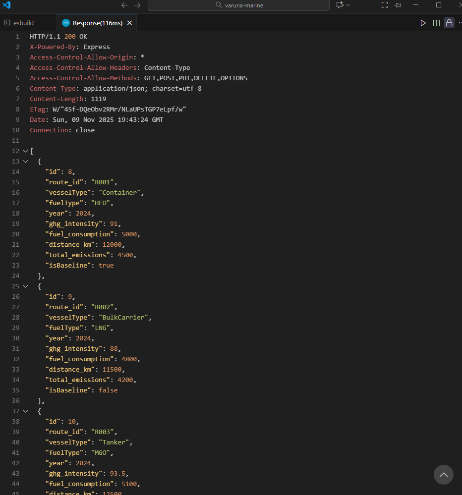
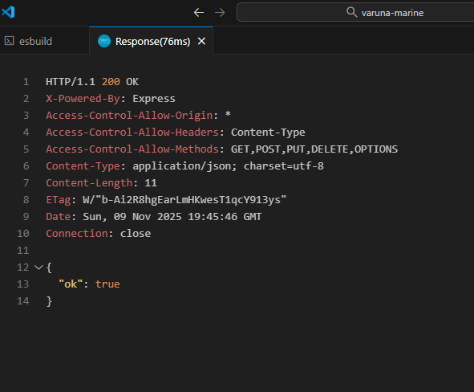
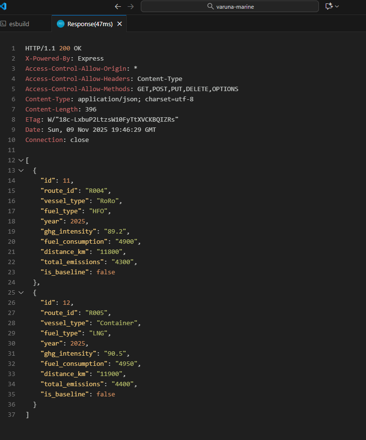
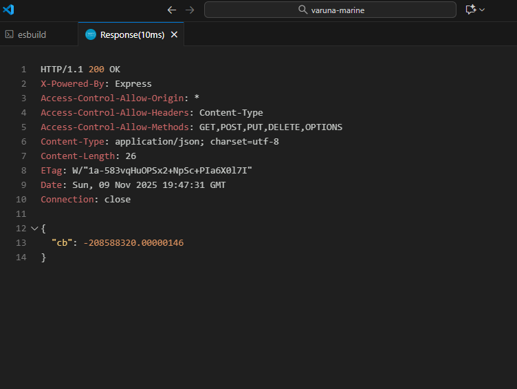
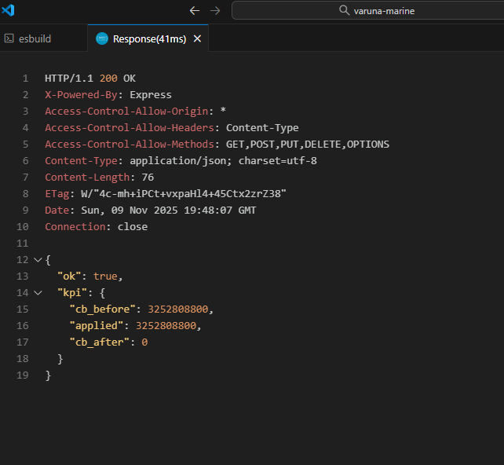
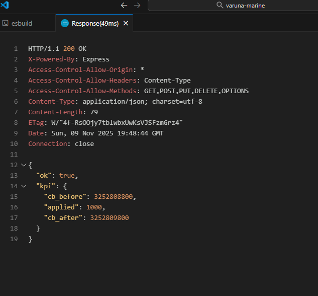
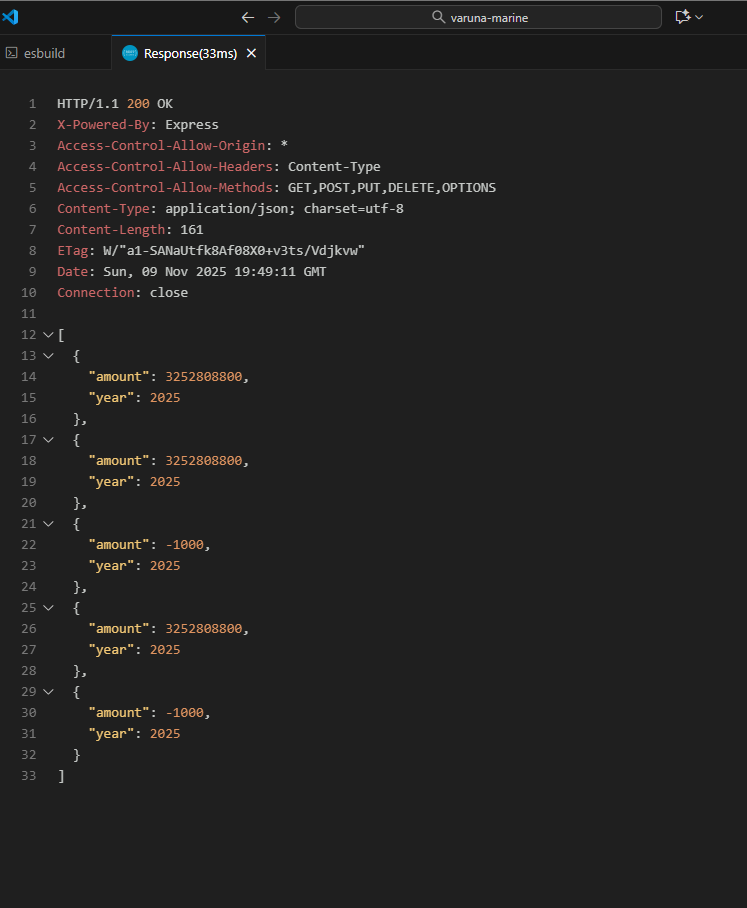
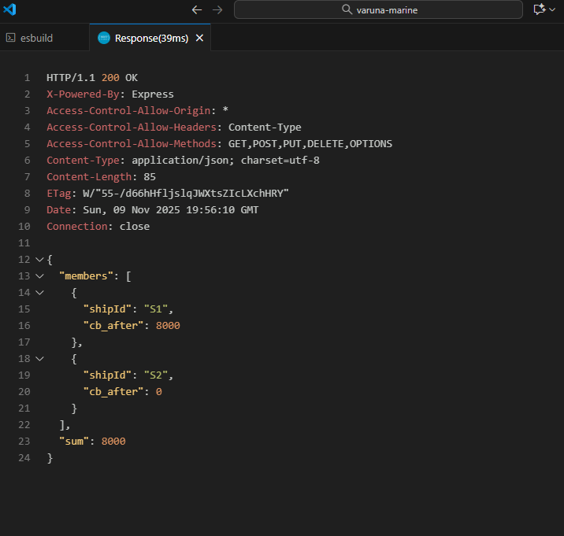

```md
# Fuel EU Maritime Compliance Platform

This project implements a minimal but structured FuelEU Maritime Compliance platform. It includes a React + TypeScript + Tailwind frontend and a Node.js + TypeScript + PostgreSQL backend, following a clean Hexagonal (Ports & Adapters) architecture.

The system supports the four main FuelEU modules:
- Routes
- Compare
- Banking
- Pooling

All modules follow domain-driven boundaries.

## Overview

The platform provides:

### Routes Dashboard
- View all routes
- Set baseline
- Filter by vesselType, fuelType, year

### Compare Module
- Compare baseline vs other routes
- Show percent difference
- Show compliance result
- Simple intensity chart

### Banking Module
- Compute CB (Compliance Balance)
- Bank positive CB
- Apply banked CB
- View historical bank entries

### Pooling Module
- Create pools across ships
- Validate FuelEU pooling rules
- Compute final CB redistribution

---
```
## Architecture (Hexagonal)

### Backend structure:

```
backend/
  src/
    core/
      domain/
      application/
      ports/
    adapters/
      inbound/http/
      outbound/postgres/
    infrastructure/
      db/migrations/
      db/seeds/
      server/
    shared/
```

### Frontend structure:

```
src/
  core/
    domain/
    application/
    ports/
  adapters/
    ui/
    infrastructure/
  shared/
```

This ensures domain logic stays independent from UI and database concerns.

---

## Setup and Run Instructions

### 1. Clone Repo

```
git clone https://github.com/Khushis04/varuna-marine.git
cd varuna-marine
```

### 2. Start PostgreSQL (Docker)

```
docker run -d --name fuel_eu_db \
  -e POSTGRES_PASSWORD=postgres \
  -e POSTGRES_DB=fuel_eu \
  -p 5432:5432 postgres:15
```

### 3. Run migrations

```
Get-Content backend/src/infrastructure/db/migrations/001_init.sql |
  docker exec -i fuel_eu_db psql -U postgres -d fuel_eu
```

### 4. Seed data

```
Get-Content backend/src/infrastructure/db/seeds/seed.sql |
  docker exec -i fuel_eu_db psql -U postgres -d fuel_eu
```

---

## Running Backend

```
cd backend
npm install
npm run dev
```

Backend runs at:

```
http://localhost:3000
```

---

## Running Frontend

```
cd frontend
npm install
npm run dev
```

Frontend runs at:

```
http://localhost:5173
```

---

## Testing

You can test the entire FuelEU backend using the included `test.http` file.

### Using VS Code REST Client

1. Install the **REST Client** extension  
   (`humao.rest-client`)
2. Open `backend/test.http`
3. Click **“Send Request”** above any HTTP block

This will execute real calls against your running backend.

### Available Requests in `test.http`

- **Get all routes**
- **Set baseline**
- **View ship routes**
- **Compare routes**
- **Compute CB**
- **Get adjusted CB**
- **Bank surplus**
- **Apply banked surplus**
- **View banking history**
- **Create pool**

Example excerpt from `test.http`:

```
### Compute Compliance Balance (CB)
GET http://localhost:3000/compliance/cb?shipId=S1&year=2025
Accept: application/json

### Bank surplus CB
POST http://localhost:3000/banking/bank?shipId=GOOD1&year=2025
Content-Type: application/json
```

This approach gives fast manual testing without needing automated tests or Postman.

## Screenshots

All screenshots are stored in the `/screenshots` directory.

You can reference them directly in Markdown like this:

```md








```

Rendered:


